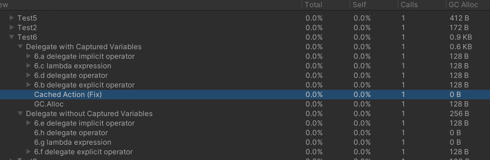

# Unity/C#.Net 常用的Memory Allocation優化整理

此repo是用來基於 [Unity/C#.Net 常用的Memory Allocation優化整理](https://qwe321qwe321qwe321.github.io/2022/04/14/Unity-CSharp-DotNet-%E5%B8%B8%E7%94%A8%E7%9A%84Memory%20Allocation%E5%84%AA%E5%8C%96%E6%95%B4%E7%90%86/) 這篇文的內容進行驗證。

Unity2020.3.31f1 / Win10

# Case1: 能用`struct`就不要用`class`
[Case1.cs](Assets/Case1.cs)

# Case2: Non-constant `string`
[Case2.cs](Assets/Case2.cs)

# Case3: `yield`
[Case3.cs](Assets/Case3.cs)

# Case4: StartCoroutine()
[Case4.cs](Assets/Case4.cs)

[CaseUniTask.cs](Assets/CaseUniTask.cs)

(This works on **release mode** in Unity2020.)

# Case5: `YieldInstruction`系列的class
[Case5.cs](Assets/Case5.cs)

# Case6: Delegate (Lambda expression / delegate operator / anonymous function)
[Case6.cs](Assets/Case6.cs)

# Case7: Captured Variable 陷阱
[Case7.cs](Assets/Case7.cs)

# Case8: Local array/list/stack/queue/hashset/dictionary
[Case8.cs](Assets/Case8.cs)

# Case9: Boxing
[Case9.cs](Assets/Case9.cs)

# Case10: `params` Array as method paramters
[Case10.cs](Assets/Case10.cs)

# Case11: `Enum.HasFlag()`
[Case11.cs](Assets/Case11.cs)

# Case12: UnityAPI: Any reference type as return value.
[CaseUnityAPIs.cs](Assets/CaseUnityAPIs.cs)

